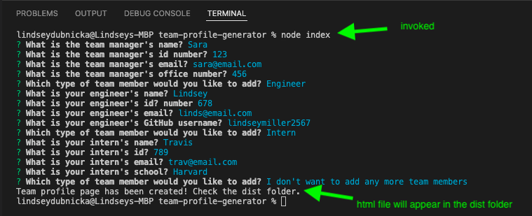
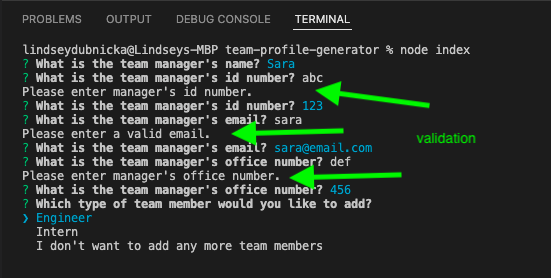

# Team Profile Generator

## Description
The team profile generator is a command-line application that takes in information about employees on a software engineering team and generates an HTML webpage that displays summaries for each person. 
  
## Installation
To install necessary dependencies, run the following command: 
```
npm install
```

## Usage
After installing the necessary dependencies, the application will be invoked from the command line by entering: `node index`
The screen shots below will give you an idea of how this application should work, or checkout the video link below to get a step-by-step demo. <br />
https://drive.google.com/file/d/1h9JOeZwVRHU6_5VFOLDru7ViW-oR8GEY/view?usp=sharing

 <br />


## Questions
Feel free to reach out to me for any questions or comments. <br/>
Link to my GitHub: github.com/lindseymiller2567